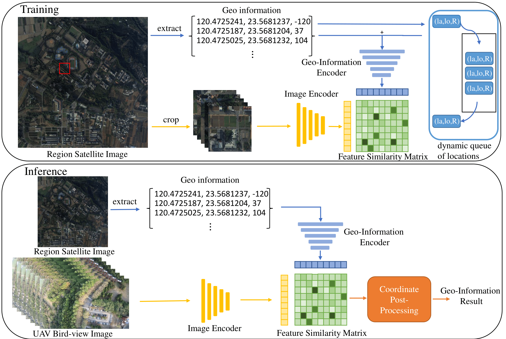

# CLIP-UAV-localization
Developing UAV localization technology using image information in the absence of GNSS signals paper code
## abstract
The primary goal of this research is to develop a method for locating the current position of an unmanned aerial vehicle (UAV) using only overhead images captured by an onboard camera when GNSS signals are interrupted or unavailable. The core approach involves using deep learning techniques to establish a relationship between the UAV's overhead images and its GPS coordinates, aiming to achieve regional localization purely based on image data. This paper proposes an end-to-end localization model that, given an overhead image of the UAV, can accurately determine the UAV's position within the region. The network architecture primarily utilizes the CLIP model proposed by OpenAI, with modifications made to enable simultaneous prediction of the UAV's latitude, longitude, and flight direction. To validate the model's performance, I manually controlled the UAV during flight and collected an overhead image dataset for testing, comprising a total of 1,625 images. The tests were conducted in a 2.23 square kilometer area, with results showing an average localization error of 39.2 meters and an average heading angle error of 15.9 degrees.all code is base on [Geo-clip](https://github.com/VicenteVivan/geo-clip) to transfer case to UAV localization

## Environment
- Python 3.8+
- cuda 11.6
- Ubuntu 20.04
- RTX 3080 Ti
## Getting start
1.Download clip-UAV file to your computer
2.Downloda [dataset file]() to your computer(remember your file location)
3.add clip-UAV environment to anaconda
```bash
conda env create -f clip-UAV.yml
```
4.remember change your dataset path(if you forgot it, Don't say that i won't tell you)
```python
dataset = GeoDataLoader(csv_file='/home/rvl122/mydataset/', dataset_folder='/home/rvl122/mydataset/')
```
5.that you can run,yay!!!!!
```bash
python main.py
```
## Notice!!
if you want to use yourself dataset, you can reference [dataset file]() arch to modified your.
## Citation
```bibtex
@inproceedings{geoclip,
  title={GeoCLIP: Clip-Inspired Alignment between Locations and Images for Effective Worldwide Geo-localization},
  author={Vivanco, Vicente and Nayak, Gaurav Kumar and Shah, Mubarak},
  booktitle={Advances in Neural Information Processing Systems},
  year={2023}
}
```
